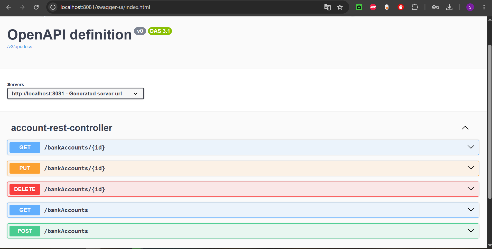

# Activité pratique N°1 : Implémentation d'un microservice avec Spring Boot

## Objectif

Cette activité consiste à développer un microservice de gestion de comptes
bancaires avec Spring Boot, puis à exposer et tester ses API REST et GraphQL.

## Énoncé et réalisations

1. Créer un projet Spring Boot avec les dépendances Web, Spring Data JPA, H2 et Lombok.
2. Créer l'entité JPA `BankAccount` (compte bancaire).
3. Créer l'interface `BankAccountRepository` basée sur Spring Data.
4. Tester la couche DAO.
5. Créer le web service RESTful de gestion des comptes.
6. Tester le microservice avec un client REST comme Postman.
7. Générer et tester la documentation Swagger des API REST.
8. Exposer une API RESTful avec Spring Data REST et des projections.
9. Créer les DTO et les mappers.
10. Créer la couche service métier du microservice.
11. Créer un web service GraphQL pour le microservice en suivant cette vidéo :
    [Spring for GraphQL](https://www.youtube.com/watch?v=FsdR09jlqaE).

## Technologies

- Java 17
- Spring Boot
- Spring Web MVC
- Spring Data JPA et Spring Data REST
- Spring for GraphQL
- H2 Database
- Lombok
- Springdoc OpenAPI / Swagger UI
- Maven

## Démarrage

Depuis ce dossier :

```bash
./mvnw spring-boot:run
```

Sous Windows :

```powershell
.\mvnw.cmd spring-boot:run
```

L'application démarre sur le port `8081` :

```text
http://localhost:8081
```

## API et interfaces

- Swagger UI : `http://localhost:8081/swagger-ui.html`
- H2 Console : `http://localhost:8081/h2-console`
- GraphiQL : `http://localhost:8081/graphiql`
- API GraphQL : `http://localhost:8081/graphql`
- API REST : consulter les contrôleurs et les repositories exposés dans `src/main/java`.

## Documentation Swagger



## Tests

```bash
./mvnw test
```

## Structure

```text
src/
├── main/java/       # Entités, DTO, mappers, repositories, services et contrôleurs
├── main/resources/  # Configuration et schéma GraphQL
└── test/java/       # Tests du projet
```
