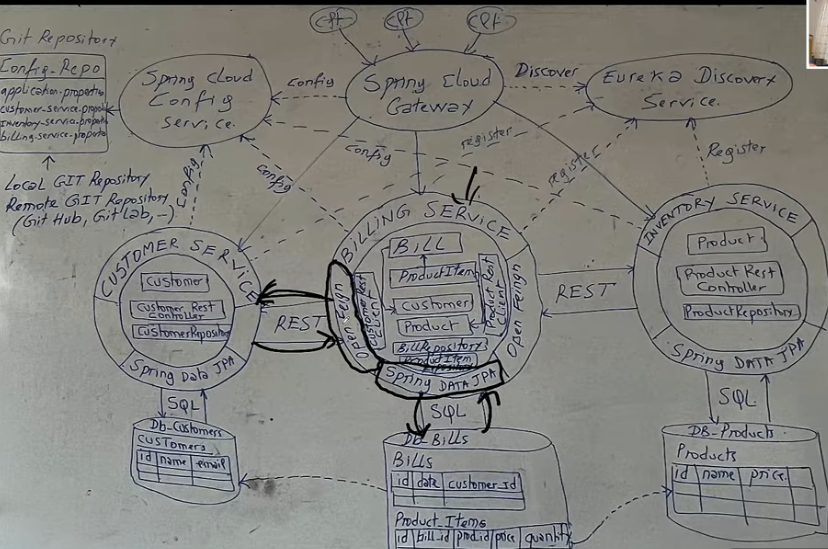
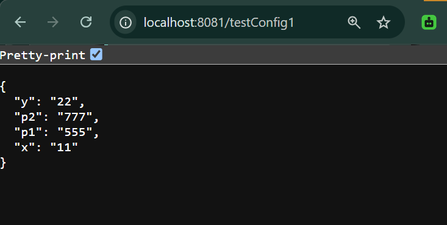
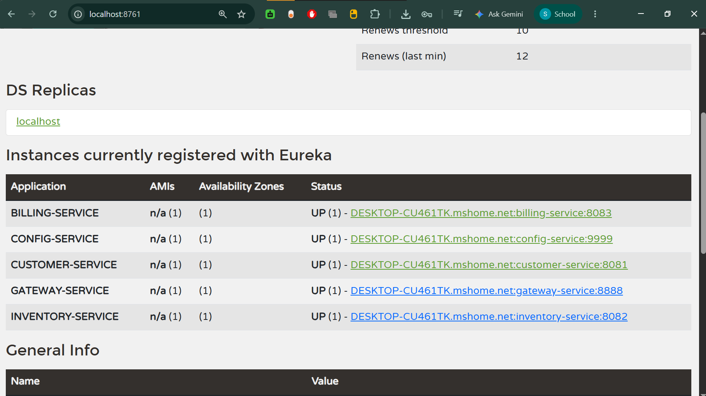
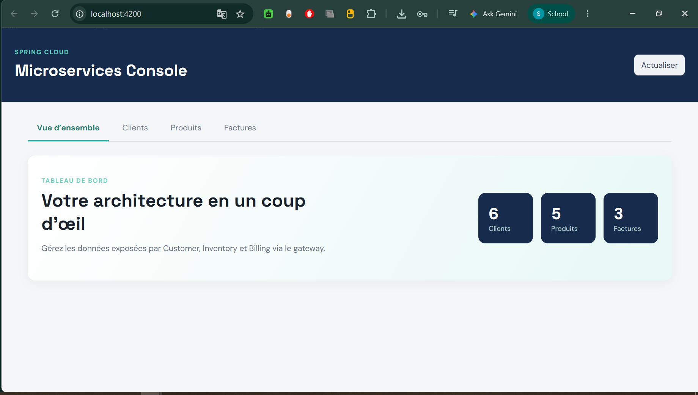
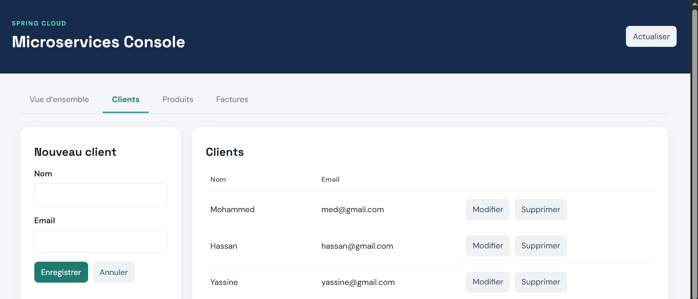
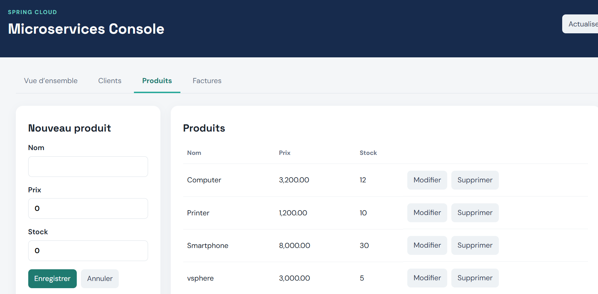
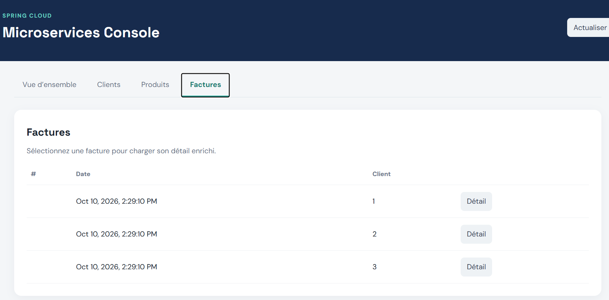

# Activité pratique N°2 : Architecture Microservices avec Spring Cloud

## Objectif

Créer une application basée sur une architecture microservices permettant de
gérer des factures contenant des produits et appartenant à un client.

Le projet met en place la découverte de services avec Eureka, la configuration
centralisée avec Spring Cloud Config, le routage avec Spring Cloud Gateway, la
communication interservices avec OpenFeign et une interface Angular.

## Énoncé réalisé

1. Créer le microservice `customer-service` pour gérer les clients.
2. Créer le microservice `inventory-service` pour gérer les produits.
3. Créer la Gateway Spring Cloud Gateway.
4. Mettre en place la configuration statique du routage.
5. Créer l'annuaire Eureka Discovery Service.
6. Mettre en place la configuration dynamique des routes de la Gateway.
7. Créer le service de facturation `billing-service` avec OpenFeign.
8. Créer le service de configuration centralisée avec Spring Cloud Config.
9. Créer un client Angular.

## Ressources pédagogiques

- [Partie 1](https://www.youtube.com/watch?v=kOVHzN8I8e8)
- [Partie 2](https://www.youtube.com/watch?v=-iM3J_mgqlM)
- [Service de configuration](https://www.youtube.com/watch?v=-G2rcLMO1gQ)
- [Dépôt de référence](https://github.com/mohamedYoussfi/micro-services-app)

## Architecture



| Composant           | Rôle                                                   |   Port |
| ------------------- | ------------------------------------------------------ | -----: |
| `discovery-service` | Annuaire Eureka et découverte des services             | `8761` |
| `config-service`    | Serveur de configuration centralisée                   | `9999` |
| `gateway-service`   | Point d'entrée HTTP, CORS et routage vers les services | `8888` |
| `customer-service`  | Gestion des clients avec JPA, H2 et Spring Data REST   | `8081` |
| `inventory-service` | Gestion des produits avec JPA, H2 et Spring Data REST  | `8082` |
| `billing-service`   | Gestion des factures et enrichissement via OpenFeign   | `8083` |
| `angular-client`    | Interface web de gestion des données                   | `4200` |

## Fonctionnement

Le client Angular communique avec la Gateway sur `http://localhost:8888`.
La Gateway distribue les requêtes vers les services enregistrés dans Eureka :

| Route publique  | Service cible       |
| --------------- | ------------------- |
| `/customers/**` | `CUSTOMER-SERVICE`  |
| `/products/**`  | `INVENTORY-SERVICE` |
| `/bills/**`     | `BILLING-SERVICE`   |

Le service de facturation utilise OpenFeign pour appeler `customer-service` et
`inventory-service`. Lorsqu'une facture est consultée, les informations du
client et des produits sont récupérées puis ajoutées à la réponse.

La configuration distante est fournie par le dépôt Git
[`config-ecom-appActivity`](https://github.com/Charef-Sohail/config-ecom-appActivity),
déclaré dans `config-service`.

## Prérequis

- Java 17 ou une version ultérieure
- Maven 3.8+ ou le Maven Wrapper fourni dans chaque service
- Node.js et npm pour le client Angular
- Un navigateur web

## Démarrage

Chaque service Spring Boot possède son propre `pom.xml`. Ouvrir un terminal
dans le dossier du service, puis exécuter :

```bash
./mvnw spring-boot:run
```

Sous Windows :

```powershell
.\mvnw.cmd spring-boot:run
```

Démarrer les composants dans l'ordre suivant :

1. `discovery-service`
2. `config-service`
3. `customer-service` et `inventory-service`
4. `billing-service`
5. `gateway-service`
6. `angular-client`

Pour lancer le frontend :

```powershell
cd angular-client
npm install
npm start
```

Puis ouvrir [http://localhost:4200](http://localhost:4200).

## Interfaces utiles

- Eureka Dashboard : [http://localhost:8761](http://localhost:8761)
- Config Server : [http://localhost:9999](http://localhost:9999)
- Gateway : [http://localhost:8888](http://localhost:8888)
- Client Angular : [http://localhost:4200](http://localhost:4200)

## Captures d'écran

### Configuration distante



### Services enregistrés dans Eureka



### Tableau de bord Angular



### Gestion des clients



### Gestion des produits



### Gestion des factures



## Tests

Dans chaque service Spring Boot :

```bash
./mvnw test
```

Dans le client Angular :

```bash
npm test
```

## Structure du projet

```text
.
├── customer-service/     # Microservice des clients
├── inventory-service/    # Microservice des produits
├── billing-service/      # Microservice des factures et OpenFeign
├── gateway-service/      # Gateway et routes Spring Cloud
├── discovery-service/    # Serveur Eureka
├── config-service/       # Serveur Spring Cloud Config
├── config-repo/          # Configurations par service et par profil
├── angular-client/       # Interface Angular
└── screenshots/          # Captures de l'application
```
